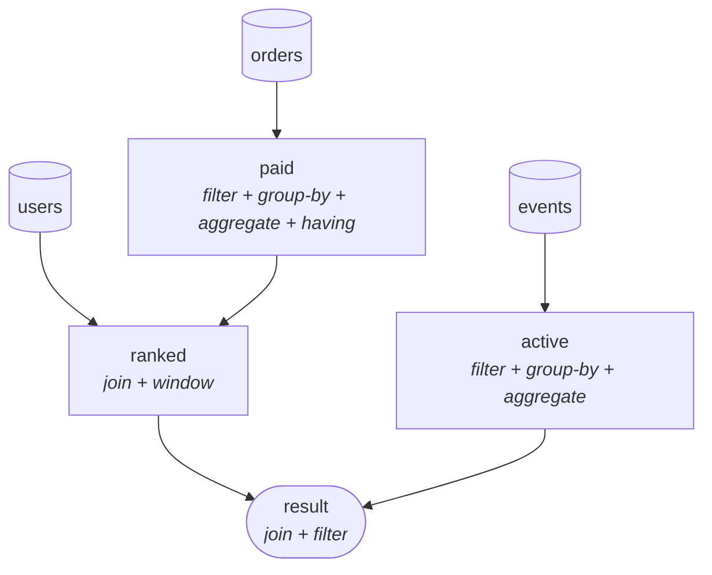
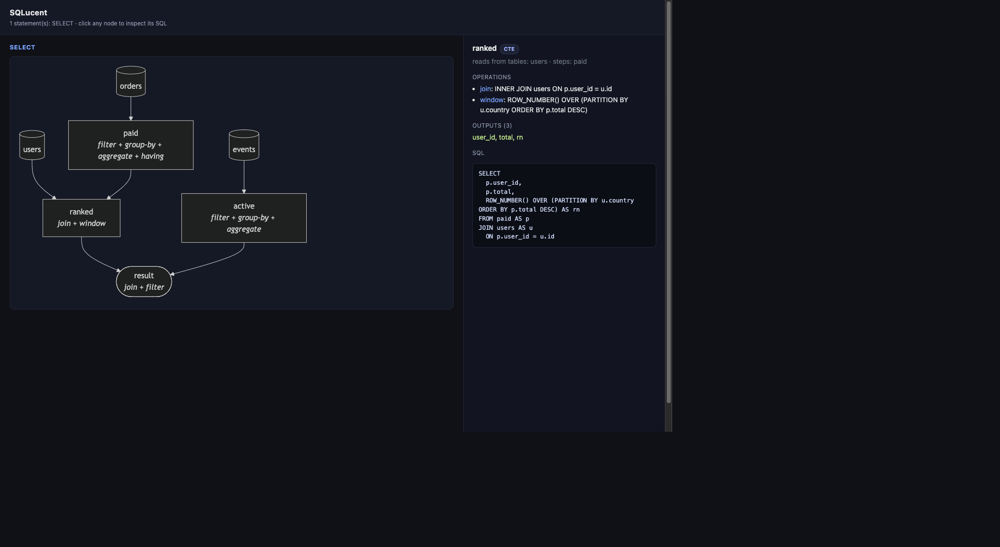

# SQLucent

[](https://github.com/thehwang/sql-x-ray/actions/workflows/ci.yml)
[](https://www.python.org/)
[](LICENSE)

> See through any SQL. Paste a gnarly nested-CTE query and get back a data-flow
> diagram, per-CTE responsibilities, and a plain-language walkthrough — **without
> running the query**.

`EXPLAIN` tells you how the database *runs* a query. SQLucent tells you what the
query *means*: where data comes from, how it flows through each CTE, and what
each step does. It really parses the SQL (via [sqlglot](https://github.com/tobymao/sqlglot)),
so the structure and diagram are trustworthy — an LLM is only used (later) to
polish the prose, never to figure out the SQL.

**Status:** data-flow graph + walkthrough, interactive HTML, column-level lineage,
risk lint, and optional local-LLM narration. Handles `SELECT`, `INSERT`,
`CREATE ... AS`, `DELETE`, `UPDATE`, and `MERGE` (multi-statement scripts and Jinja
templating included). BigQuery dialect by default. See [`DESIGN.md`](DESIGN.md) for
the full design and roadmap.

## Demo

Given a nested-CTE query ([`examples/top_users.sql`](examples/top_users.sql)),
`sqlucent query.sql --mermaid` produces this data-flow graph (rendered live on
GitHub):



`--html` turns the same graph into a self-contained interactive page: click any
node to highlight it and inspect that node's SQL, sources, operations, and outputs.



## Install (dev)

```bash
python3 -m venv .venv && source .venv/bin/activate
pip install -e ".[dev]"
```

## Usage

Two commands are installed: `sqlucent` and the short alias `sxr` (identical).

```bash
sxr examples/top_users.sql                 # short alias for sqlucent
sqlucent examples/top_users.sql            # walkthrough + Mermaid graph
sqlucent query.sql --mermaid               # just the diagram
sqlucent query.sql --walkthrough           # just the steps
sqlucent query.sql --verbose               # full join ON clauses + column lists
sqlucent query.sql --json                  # the IR, for tooling/CI
sqlucent query.sql --html > xray.html      # self-contained interactive page
sqlucent query.sql --lineage               # column-level lineage (all outputs)
sqlucent query.sql --lineage total         # lineage for one output column
sqlucent query.sql --lint                  # risk checks
sqlucent query.sql --lint --fail-on high   # CI gate: exit non-zero on a high finding
cat query.sql | sqlucent -                 # read from stdin
sqlucent query.sql --dialect postgres      # other dialects
```

The Mermaid output renders directly on GitHub, in Markdown, and in Notion.

### Interactive HTML (`--html`)

`--html` emits a single self-contained page (no server) with the data-flow
diagram. Click any node to highlight it and inspect that node's SQL, sources,
operations, and outputs in a side panel.

By default Mermaid is **inlined**, so the page is fully offline — open it on a
plane, archive it, email it. That makes the file ~3 MB. Use `--cdn` to load
Mermaid from a CDN instead for a tiny (~8 KB) file that needs network to view.

```bash
sqlucent query.sql --html > xray.html && open xray.html   # offline, ~3 MB
sqlucent query.sql --html --cdn > xray.html               # tiny, needs network
sqlucent query.sql --html --lang Chinese > xray.html      # localized UI chrome
```

`--lang` localizes the page's UI labels (English and Chinese built in; unknown
languages fall back to English). SQL identifiers are never translated.

### Column-level lineage (`--lineage`)

Trace each final output column back to the source columns it comes from, followed
through every CTE and subquery (powered by sqlglot's lineage engine — no schema
required for explicit column references):

```bash
sqlucent examples/top_users.sql --lineage
#   user_id     ←  orders.user_id
#   total       ←  orders.amount
#   last_login  ←  events.login_at
```

Pass a column name to trace just one (`--lineage total`). `SELECT *` and bare
expressions can't be resolved by name **unless you supply a schema**:

```bash
# --schema takes DDL (CREATE TABLE ...) or a {table: {column: type}} JSON file.
sqlucent "SELECT * FROM users u JOIN orders o ON u.user_id=o.user_id" \
  --lineage --schema examples/schema.sql
#   name    ←  users.name
#   email   ←  users.email
#   amount  ←  orders.amount
#   ...
```

With a schema, `SELECT *` is expanded into its real columns and each is traced to
its base table (aliases are resolved back to table names).

### Risk lint (`--lint`)

Deterministic anti-pattern checks over the AST — no LLM, so findings are stable
and CI-friendly:

| rule | severity | what it catches |
|------|----------|-----------------|
| `full-table-write` | high | `UPDATE`/`DELETE` with no `WHERE` — affects every row |
| `cartesian-join` | high | condition-less join between tables (comma/`CROSS JOIN`), row explosion |
| `select-star` | medium | `SELECT *` — brittle to schema changes, wider scans |
| `having-without-aggregate` | medium | `HAVING` with no aggregate that belongs in `WHERE` |
| `distinct-with-group-by` | low | redundant `DISTINCT` alongside `GROUP BY` |

```bash
sqlucent query.sql --lint                  # report findings
sqlucent query.sql --lint --fail-on high   # exit 1 if any finding ≥ high (CI gate)
```

### Plain-language narration (local LLM, optional)

With [Ollama](https://ollama.com) running, `--narrate` turns the parsed facts into
fluent prose. The model only rephrases a deterministic fact sheet built from the
parsed IR — it never sees the raw SQL and is told never to invent tables or
columns — so the explanation stays grounded. If Ollama isn't running or the model
isn't pulled, it falls back to the template walkthrough.

```bash
sqlucent query.sql --narrate                      # default model (llama3.2)
sqlucent query.sql --narrate --model qwen2.5:3b   # pick a model
sqlucent query.sql --lang Chinese                 # narrate in any language (implies --narrate)
export SXR_OLLAMA_MODEL=qwen2.5:3b                 # or set a default model
export SXR_LANG=Chinese                            # or set a default language
```

`--lang` writes the prose in the given language while keeping SQL identifiers
(table/column/step names) unchanged.

## How it works

```
SQL → sqlglot AST → Semantic Model (IR) ─┬─ CTE responsibilities
                                          ├─ data-flow graph (Mermaid)
                                          └─ plain-language walkthrough
```

The IR is the hub; every feature is a consumer of it. This keeps the
deterministic core (parsing, graph, lineage) separate from the probabilistic
shell (LLM narration, coming in v0.2).

## Releasing

Publishing to PyPI uses **Trusted Publishing (OIDC)** — no API token or stored
secret. One-time setup on PyPI, then every GitHub Release publishes automatically:

1. On [pypi.org](https://pypi.org) → your account → *Publishing* → add a
   **pending trusted publisher**:
   - PyPI Project Name: `sqlucent`
   - Owner: `thehwang`, Repository: `sql-x-ray` (the GitHub repo name is unchanged)
   - Workflow name: `publish.yml`
   - Environment name: `pypi`
2. In the GitHub repo, create an environment named `pypi`
   (Settings → Environments).
3. Cut a release — tag it `vX.Y.Z` and publish via the GitHub UI or:

```bash
gh release create v0.1.0 --title "v0.1.0" --notes "First release."
```

The `publish.yml` workflow builds the sdist + wheel and uploads them to PyPI.

## License

MIT
